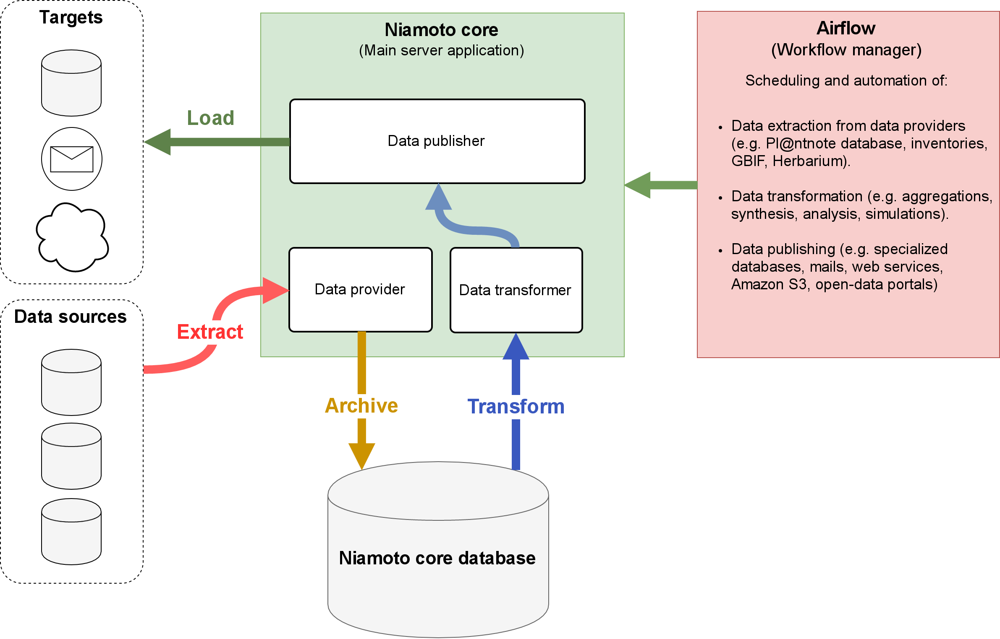

Project overview
================

Niamoto is an ecological information system designed to fill the gap between
scientists and decision makers. It is currently being used and developed for
tropical rainforest ecosystems in New Caledonia, but had been designed
generic enough to be adapted for other ecosystems and contexts.

Niamoto's objective is to provide a platform for aggregating ecological data
from several data sources, defining and running scientific data workflows and
distributing value-added data in several formats, for several purposes.

In decision support terms, Niamoto is an ecological data warehouse providing
ETL (Extract, Transform, Load) functionalities. Niamoto aggregates
multi-sources ecological data in a high quality, structured central data
warehouse. This data can be used for scheduling and running scientific
workflows, which results can be then published for scientists (e.g. csv files,
raster files, vector files) or for systems (e.g. databases, web services).

Bellow is a diagram of how Niamoto is structured in the main lines, and how
it interacts with data sources and targets:

|

