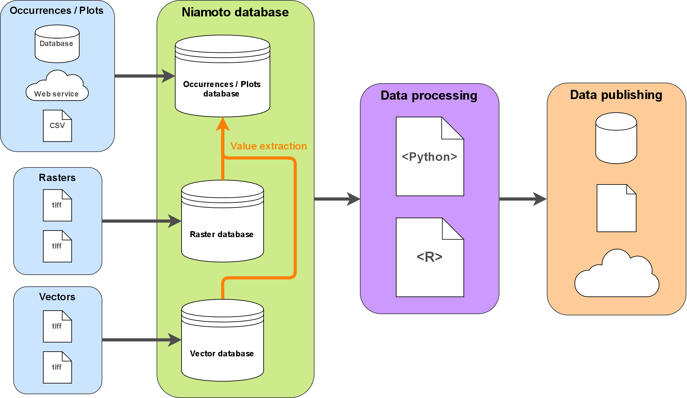

.. _overview:

Project overview
================

What is Niamoto?
----------------

Niamoto is an ecological data warehouse framework designed to fill the gap
between scientists and decision makers. It is currently being used and
developed for tropical rainforest ecosystems in New Caledonia, but had been
designed generic enough to be adapted for other ecosystems and contexts.

Niamoto's objective is to provide a platform for aggregating ecological data
from several data sources, defining and running scientific data workflows and
distributing value-added data in several formats, for several purposes.
Niamoto provides ETL (Extract, Transform, Load) functionalities, a structured
and persistent staging area and functionalities to publish data marts.
Niamoto data marts can be seamlessly loaded into the **cubes** OLAP framework.

Niamoto comes with a command-line interface (CLI), and a Python API.

Niamoto structure
-----------------

Bellow is a diagram of how Niamoto is structured in the main lines, and how
it interacts with data sources and targets:

|

.. image:: _static/niamoto-core_ETL.png
    :scale: 100 %

|

Niamoto data flow
-----------------

Here a diagram describing the Niamoto data flow in the main lines:

|

